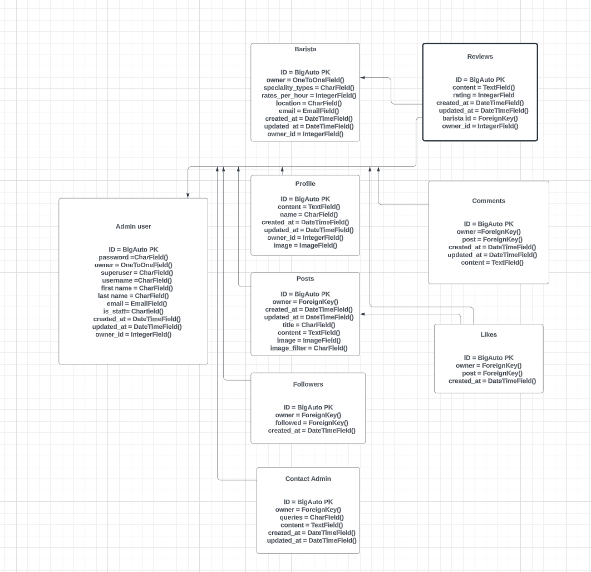
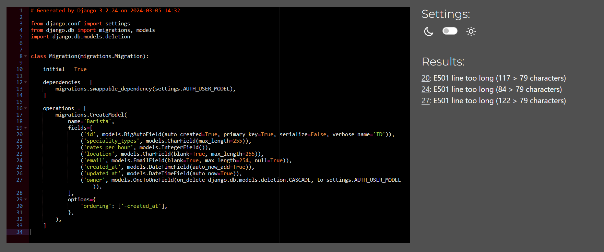
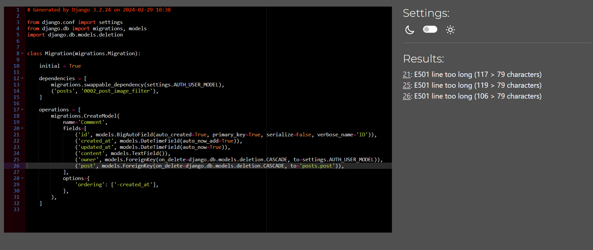
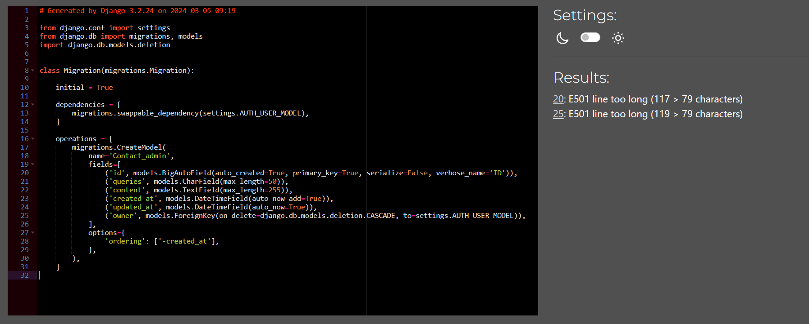
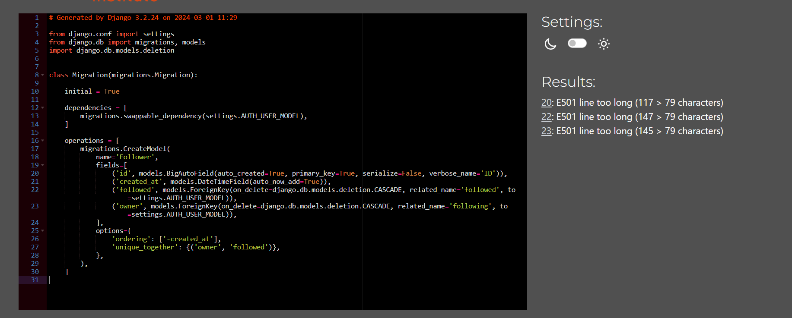
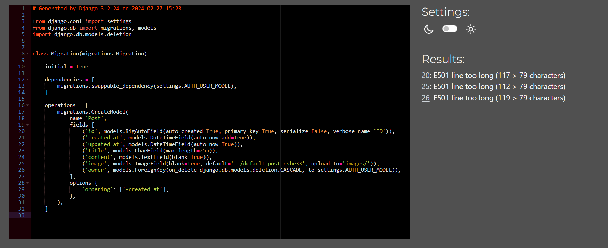
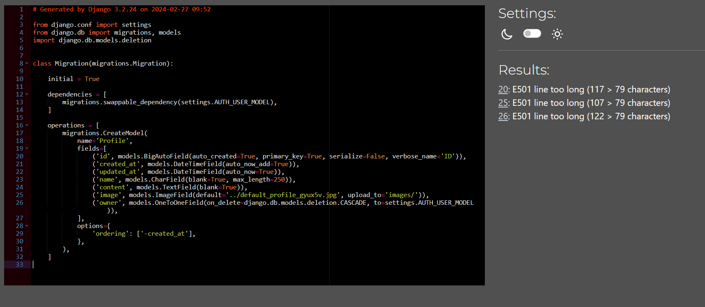
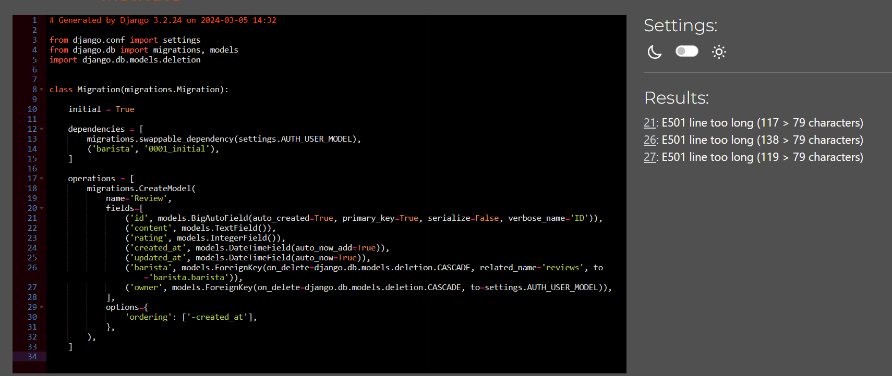

# Coffee Social API

## Introduction 

The Coffee Social API is Back-end database that caters for my front-end React project, the Coffee Social. the coffee Social is a social site for coffee lovers to post or blog about there coffee jerney and or to trubble shoot there coffee recipes.

The site allows an Admin user to login using a pre-registered login(superuser) from there the Admin-user can create, read, update and delete(CRUD) Profiles, post and comments. 

This website also allows a users to create a login, make a post on the wbesite and view an edit the there posts and comment/like others. 

To create this website Agile principles where used. The frameworks used were django and Django rest framwork. 

 + This is a link to my live website [Live site](https://coffee-social-4aee33ad3a6e.herokuapp.com/)
 + This is a link to my Repo [Repo](https://github.com/Brionconroy/Coffee_social_api)

--- 

## Table of Contents 

 
 

 - ## [Introduction](#introduction) 

 
 

 - ## [Agile Methodologie](#agile-methodologie-1) 

 
 

 - ## [User Experience](#user-experience-1) 

 - ## [Technologies](#technologies-1) 

     

- ## [Testing](#testing-1) 

    - ## [Bugs](#bugs-1) 

    - ## [Manual Testing](#manual-testing-1) 

    - ## [Code Validation](#code-validation-1) 

- ## [Deployment](#deployment-1) 

 
 

- ## [Credits](#credits-1) 

--- 

 
 

## Agile Methodologie 

 
 

Agile principles were utilised throughout the planning and development of this project. The tecnoligy used in this project was github issues which were categorised into user storys, seperate out into tasks for various aspects of the project. The issues were then added into a project board through github issues as shown. 

 
 

 

 
 

Agile
  

 
 

 

 
 

 

 
 
 

I created a user storys template through github issues to layout each user stories containing acceptance criteria. These requirements were altered through the project as things dont always go to plan and new ideas can happen. I also used the MoSCoW method while developing this project this helped to prioritize certian feature ahead of others by using tags on the user storys into three differnt actagorys (Must Haves, Should Have, Could Have). By focusing on the Must Haves first you end up with a MVP (minimuim viable prject) qiucker. 

 
 

 

 
 

User Storys
  

 
 

 

 
 

 

 
 

## User Experience 

 
 

As a new visitor to the site, I would like to be able to make a booking and edit it acourdingly. i would also like to be able to login to the website so that i may find and edit my booking. As a returning customer, I want to be able to easily navigate the site and quickily find what I'm looking for. I would also like the ability to contact the Resteraunt directly through their website. 

 
 

### The User Experience Design was constructed using the five planes. 

 
 

+ Stratagy: Is this content relvent to the user and is it appropriate for the database? 

+ Scope: Are we accomplishing our goals of having a fully functioning database. 

+ Structure: How many pages should we have in our website and why? 

+ Skeleton: Does the structure of the database meet the users needs?

+ Surface: Does the site look good visully?

## Milestones

### Setup

+ This milestone covers all the inital setup with Django, Django REST Framework and cloadinary.

### Profile

+ This Milestone covers all CRUD functionality and API endpoint creation in the database for profiles.

### Posts

+ This Milestone covers all CRUD functionality and API endpoint creation in the database for user posts.

### Comments

+ This Milestone covers all CRUD functionality and API endpoint creation in the database for user Comments on posts.

### Barista

+ This Milestone covers all CRUD functionality and API endpoint creation in the database for user who register as a Barista.

### Reviews

+ This Milestone covers all CRUD functionality and API endpoint creation in the database for Reviewing a barista and leaving a star-rating.

### Contact Admin

+ This Milestone covers all functionality and API endpoint creation in the database for Contacting the administrater with any issues you may have.

### Followers

+ This Milestone covers all functionality to be able to follow other users.

## User Storys

+ This is a link to user storys and milestones [Repo](https://github.com/Brionconroy/Coffee_social_api/issues)

## DataBase Design

 

 
 

Database Design
  

 
 

 

 
 

 

 

 

## Technologies 

 
 

### Libraries, Frameworks, Tools 

 
 

* [Django 3.2.22](https://www.djangoproject.com/)

* [djangorestframework==3.14.0](https://www.django-rest-framework.org/) 

* [pillow==10.2.0](https://pillow.readthedocs.io/en/stable/) 

* [Heroku](https://www.heroku.com) 

* [ElephantSQL](https://www.elephantsql.com/) 

* [SQLite3](https://www.sqlite.org/index.html) 

* [Cloudinary 1.36.0](https://cloudinary.com/) 

* [Gunicorn 21.2.0](https://gunicorn.org/) 

* [Psycopg2 2.9.9](https://pypi.org/project/psycopg2/) 

* [GitPod](https://www.gitpod.io/) 

* [GitHub](https://github.com/) 

* [CI pep8 linter](https://pep8ci.herokuapp.com/) 

### Languages 

 

* [Python 3.9](https://www.python.org/downloads/release/python-390/) 

 
 
 

# Testing 

## Validation testing

All code was passed throught the pep8 validater and was cleaned up. The only code that was not tampered with was the django generated code. the lines where too long as showen.

 

 
 

barista initial file
  

 
 

 

 
 

 

 

 
 

comment initial file
  

 
 

 

 
 

 

 
 

contact-admin initial file
  

 
 

 

 
 

 

 

 
 

followers initial file
  

 
 

 

 
 

 

 

likes initial file
  

 
 

 

 
 

 

 

posts initial file
  

 
 

 

 
 

 

 

profiles initial file
  

 
 

 

 
 

 

reviews initial file
  

 
 

 

 
 

 

 

settings.py
  

 
 

 

 
 

### Bugs

+ There was a bug that was addressed on user logout as they are not doing anymore updates of that old version if django i found a work around online.

## Deployment

The first thing you should do when creating a new project is to deploy it as quick as you can to prevent any nasty errors that might be a pain to fix when your project is complete. For this project I used Heroku to deploy too. The framework I used in this project was Django, so the first thing you need to do is to create a Django project in you work space and install all the supporting libraries. Once evrthing is installed you should you should make a migration to the database with a small model to make sure everything works. 

 
 

Just to make a note of this the database used in the workspace (db.sqlite3) does not work when deployed to Heroku so we need a differnt database when deplying. I used ElephantSQL database as it was free and works with Heroku. 

 
 

### Installing Django and Libraries 

 
 

+ Step 1: Django and Gunicorn installation enter in the terminal: 

 
 

        pip3 install 'django<4' gunicorn 

+ Step 2: Install Supporting Libraries in the terminal: 

 
 

        pip3 install dj_database_url==0.5.0 psycopg2 

+ Step 3: Install Cloudinary Libraries in the terminal: 

 
 

        pip3 install dj3-cloudinary-storage 

        pip3 install urllib3==1.26.15 

+ Step 4: Create a requirements file in the terminal: 

 
 

        pip3 freeze --local > requirements.txt 

+ Step 5: Create a Project in the terminal: 

 
 

        django-admin startproject *Your Project name*. 

+ Step 6: Create a App in the terminal: 

 
 

        python3 manage.py startapp *App name* 

+ Step 7: Add App name to the  Installed Apps in setting.py file. 

 
 

+ Step 8: Migrate the changes enter in the terminal: 

 
 

        python3 manage.py migrate 

+ Step 9: Run the local server to make sure that everthing works, enter in the terminal: 

 
 

        python3 manage.py runserver 

+ Step 10: Add your local URL from the preview page to your setting.py file in the section thats called ALLOWED HOST. You must also Add your Heroku URL here too. 

 
 

+ Step 11: Create ElephantSQL Database, by creating/login to your account, creating a new instance, and copying the URL into Heroku (See step 13) 

 
 

+ Step 12: Create a new Heroku project by creating/login to your account and clicking (Create new app). Pick a name for your project and the region that your project is base in. Then click CREATE APP. 

 
 

+ Step 13: In the Heroku app setting click on Reveal Config Vars, add DATABASE_URL as a value with the URL from ElephantSQL as the Key. Repeat this step for SECRET_KEY, DEBUG, CLOUDINARY_URL, Port and DISABLE_COLLECTSTATIC as seen in the image below. 

 
 

    
 

 
 

    
config var Image
  

 
 

     

 
 

    
 

 
 

+ Step 14: IN your workspace create an env.py file to store all your sensative data, like in step 13 add your DATABASE_URL, SECRET_KEY and CLOUDINARY_URL to this file. at the top of this file add import os. 

 
 

    
 

 
 

    
Env.py
  

 
 

     

 
 

    
 

 
 

+ Step 15: Go back to setting.py file and at the top add these lines of code 

 
 

        from pathlib import Path 

        import os 

        import dj_database_url 

        if os.path.isfile('env.py'): 

            import env 

 
 

    
 

 
 

    
Top of Setting.py
  

 
 

     

 
 

    
 

 
 

+ Step 16: In Setting.py find where it say SECRET_KEY and replace it with: 

 
 

        SECRET_KEY = os.environ.get('SECRET_KEY') 

 
 

+ Step 17: IN setting.py find the section DATABASES and comment out the section of code. 

 
 

    
 

 
 

    
Database Comment Out
  

 
 

     

 
 

    
 

 
 

+ Step 18: IN setting.py just below DATABASES the commented out section, add this code. 

 
 

        DATABASES = { 

            'default': dj_database_url.parse(os.environ.get("DATABASE_URL")) 

        } 

 
 

    
 

 
 

    
Database Add
  

 
 

     

 
 

    
 

 
 
 

+ Step 19: At this point it is a good idea to make a migration, so in the terminal: 

 
 

        python3 manage.py migrate 

 
 

+ Step 20: IN setting.py in the Installed Apps section add (location added is importent see image below): 

 
 

        'cloudinary_storage', 

        'cloudinary', 

 
 

    
 

 
 

    
Cloudinary
  

 
 

     

 
 

    
 

 
 

+ Step 21: IN setting.py find the area called Static files and add this code.(makes Django use cloudinary for storing static files) 

 
 

        STATIC_URL = '/static/' STATICFILES_STORAGE = ('cloudinary_storage.storage.' 'StaticHashedCloudinaryStorage') STATICFILES_DIRS = [os.path.join(BASE_DIR, 'static'), ] STATIC_ROOT = os.path.join(BASE_DIR, 'staticfiles') 

 
 

        MEDIA_URL = '/media/' DEFAULT_FILE_STORAGE = 'cloudinary_storage.storage.MediaCloudinaryStorage' 

 
 

        DEFAULT_AUTO_FIELD = 'django.db.models.BigAutoField' 

 
 

    
 

 
 

    
Cloudinary Static
  

 
 

     

 
 

    
 

 
 

+ Step 22: IN setting.py add this code just below BASE_DIR 

 
 

        TEMPLATES_DIR = os.path.join(BASE_DIR, 'templates') 

 
 

+ Step 23: create 3 new in the base directory static templates and media 

 
 

+ Step 24: IN setting.py In the templates array add this: 

 
 

        'DIRS': [TEMPLATES_DIR], 

 
 

    
 

 
 

    
TEMPLATES
  

 
 

     

 
 

    
 

 
 

+ Step 25: Add a Procfile to the root directory make sire the Procfile has a capital P. In the Procfile add this code: 

 
 

        web: gunicorn cornerbistro.wsgi 

 
 

+ Step 26: In your Heroku app navigate to the setting and add buildpack: heroku/python. 

 
 

+ Step 27: Link your GitHub Repo to your project. 

 
 

+ Step 28: Navigate to the deploy section and click on Automatic deployment (mian) 

 
 

+ Step 29: Well done!! 

 
## Conclusion

This project has thought me a lot about the differnt technologys used. It has also thought me a lot about time constrains and working to a deadline. The deadlines forced me to prioritize differnt parts of the project with User Storys and MoSCoW thinking. Moving on if you get stuck on something small and come back to it at a later time is a must when you have time constains. keeping everything well documented is a must, when not fully finishing feature (if you get stuck) so that when you come back to the feature you can pick up where you left off. 

## Credits 

+ Thanks to the tutors at Coding instatute and to my mentor Garath for guiding me through my project. I would also like to thank Katie Duggan for proofreading the content.
 

+ This helped me set up my crispyform [Crispy Forms](https://simpleisbetterthancomplex.com/tutorial/2018/08/13/how-to-use-bootstrap-4-forms-with-django.html) 

 

### Media 

 
 

Background image was taken from [pexels](https://www.pexels.com/search/bistro/) 

 
 

Favicon was generated by [favicon](https://favicon.io/favicon-generator/) 

 
 

 